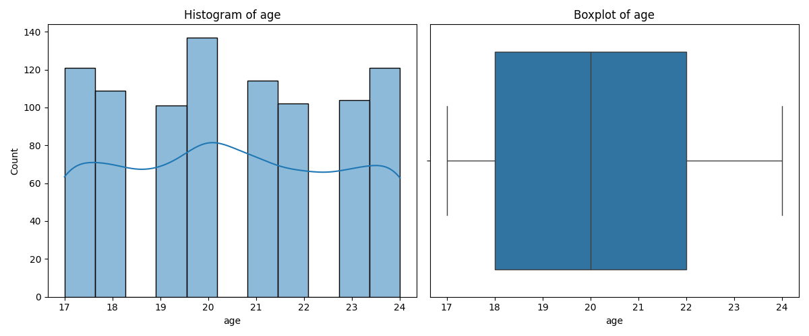

<class 'pandas.core.frame.DataFrame'>
RangeIndex: 1000 entries, 0 to 999
Data columns (total 15 columns):
 #   Column                         Non-Null Count  Dtype  
---  ------                         --------------  -----  
 0   age                            1000 non-null   int64  
 1   gender                         1000 non-null   object 
 2   study_hours_per_day            1000 non-null   float64
 3   social_media_hours             1000 non-null   float64
 4   netflix_hours                  1000 non-null   float64
 5   part_time_job                  1000 non-null   object 
 6   attendance_percentage          1000 non-null   float64
 7   sleep_hours                    1000 non-null   float64
 8   diet_quality                   1000 non-null   object 
 9   exercise_frequency             1000 non-null   int64  
 10  parental_education_level       909 non-null    object 
 11  internet_quality               1000 non-null   object 
 12  mental_health_rating           1000 non-null   int64  
 13  extracurricular_participation  1000 non-null   object 
 14  exam_score                     1000 non-null   float64
dtypes: float64(6), int64(3), object(6)
memory usage: 117.3+ KB

            There seems to be only 909/1000 non nulls in the 
            'parental_education_level' column
            This is roughly 10% of the sample, so for now let's
            drop the rows
                          age  study_hours_per_day  social_media_hours  netflix_hours  attendance_percentage  sleep_hours  exercise_frequency  mental_health_rating  exam_score
count  909.000000           909.000000          909.000000     909.000000             909.000000   909.000000          909.000000            909.000000  909.000000
mean    20.475248             3.538724            2.504620       1.830363              83.880308     6.474037            3.051705              5.466447   69.558196
std      2.302721             1.469730            1.164802       1.071251               9.453622     1.218943            2.035632              2.857525   16.929436
min     17.000000             0.000000            0.000000       0.000000              56.000000     3.200000            0.000000              1.000000   18.400000
25%     18.000000             2.500000            1.700000       1.000000              77.500000     5.600000            1.000000              3.000000   58.400000
50%     20.000000             3.500000            2.500000       1.800000              84.200000     6.500000            3.000000              5.000000   70.400000
75%     22.000000             4.500000            3.300000       2.600000              90.700000     7.300000            5.000000              8.000000   81.300000
max     24.000000             8.300000            7.200000       5.400000             100.000000    10.000000            6.000000             10.000000  100.000000

            
            